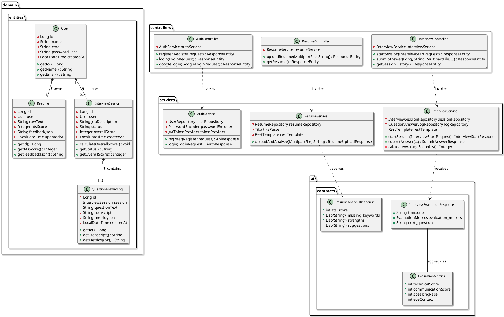
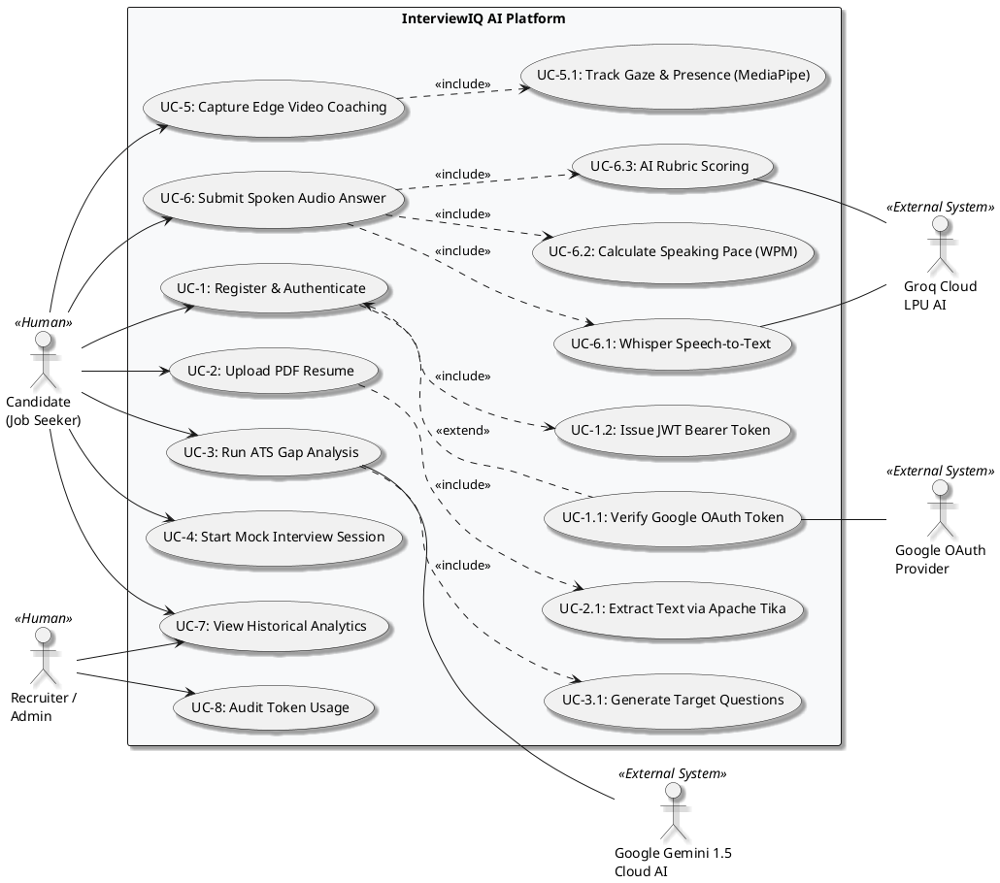
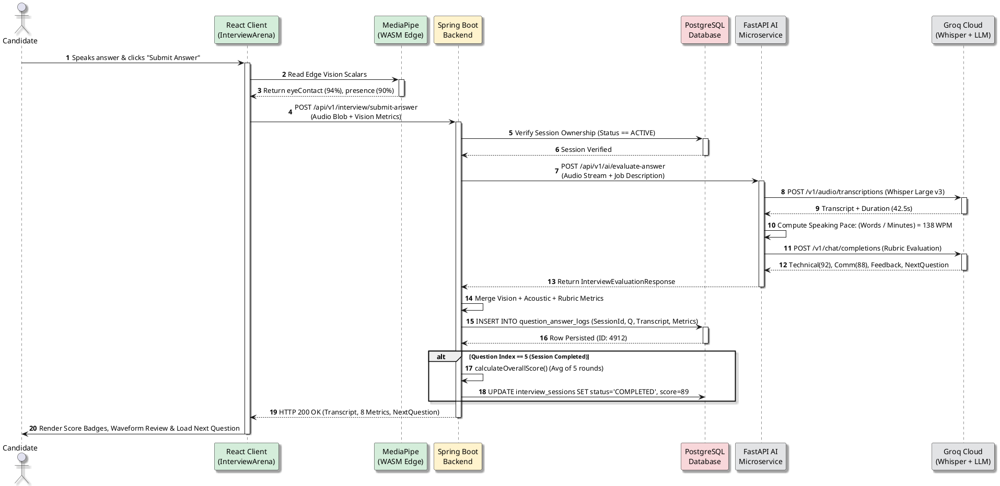
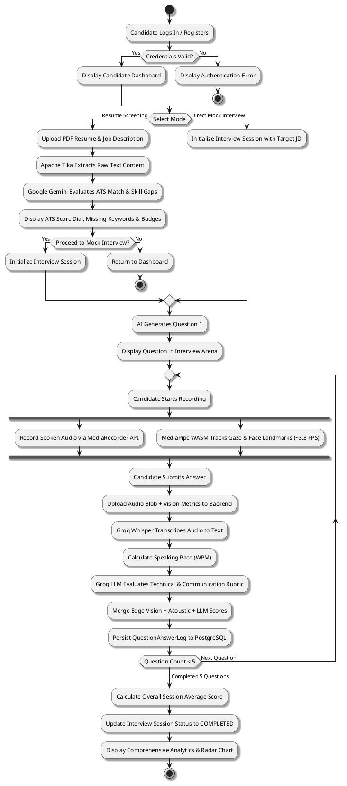
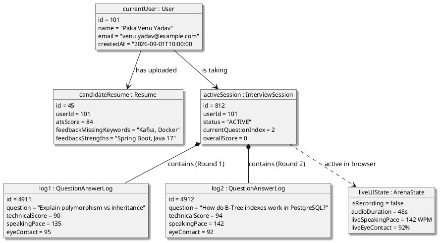
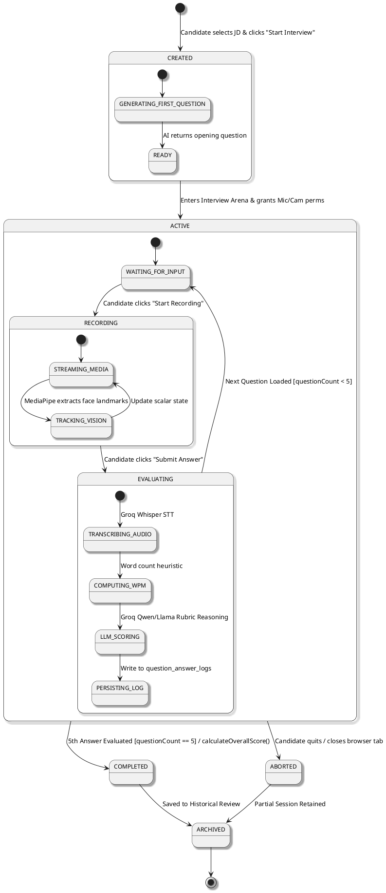
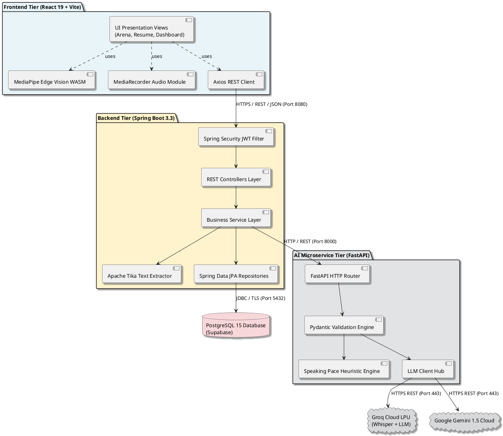
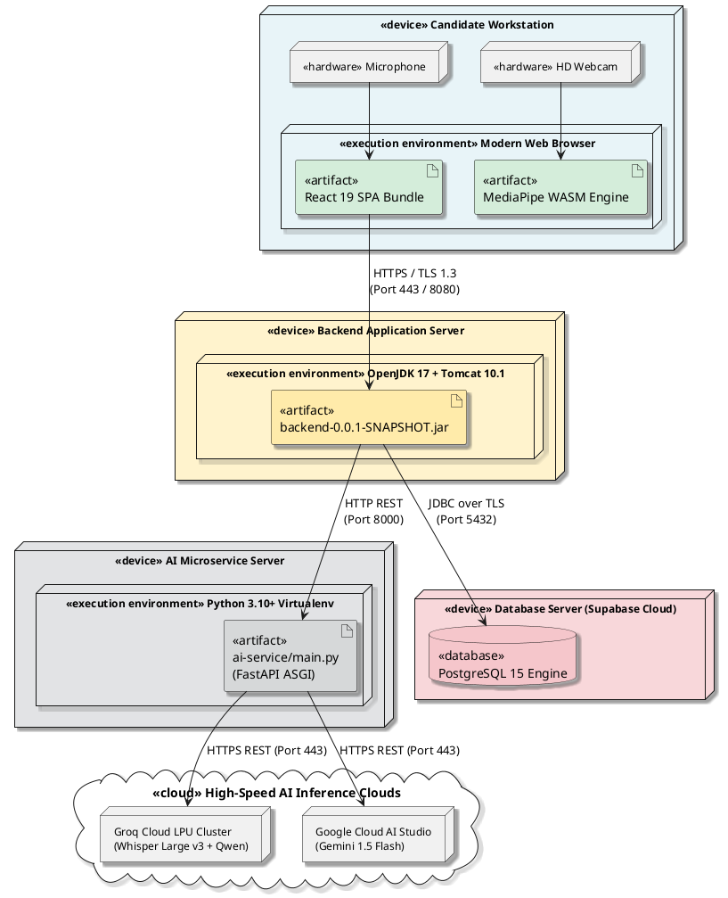

# InterviewIQ AI — Complete PlantUML Design Presentation Specification
**System:** AI Resume Screening and Multimodal Mock Interview System  
**Presentation Track:** System Analysis & Object-Oriented Design (UML Architecture)  
**Standard:** UML 2.5 Specification modeled in **PlantUML**  
**Architecture:** Decoupled 3-Tier Monorepo (React 19 + Spring Boot 3.3 + FastAPI + PostgreSQL + Multimodal AI)

---

## Interactive Presentation Deck
You can open the complete interactive slide deck directly in your browser:
- **Presentation Deck:** [docs/presentation.html](file:///d:/AI%20Resume%20Screening%20and%20Mock%20Interview%20System/docs/presentation.html)
- **Features:** Authentic vector PlantUML diagrams, keyboard shortcuts (`←`/`→`/`Space`), Zoom In/Out (`+`/`-`), Fullscreen mode (`⛶ Present`), and a live **"📄 View .puml Source"** code inspector with one-click clipboard copying.

---

## Table of Contents
1. [Class Diagram (Structural Model)](#1-class-diagram)
2. [Use Case Diagram (Behavioral Model)](#2-use-case-diagram)
3. [Sequence Diagram (Dynamic Interaction Model)](#3-sequence-diagram)
4. [Activity Diagram (Operational Workflow Model)](#4-activity-diagram)
5. [Object Diagram (Runtime Instance Snapshot)](#5-object-diagram)
6. [State Chart Diagram (State Machine Model)](#6-state-chart-diagram)
7. [Collaboration Diagram (Communication Topology Model)](#7-collaboration-diagram)
8. [Component Diagram (Modular Subsystems Model)](#8-component-diagram)
9. [Deployment Diagram (Physical Hardware & Infrastructure)](#9-deployment-diagram)
10. [Viva / Presentation Defense Guide](#10-viva--presentation-defense-guide)
11. [PlantUML Source Files Directory](#11-plantuml-source-files-directory)

---

## 1. Class Diagram
### Categorization: Structural Diagram (UML 2.5)
### Purpose:
Illustrates the static structure of the system, showing domain JPA entities, Spring Boot REST controllers, service isolation, repository interfaces, and strongly typed AI contracts.

### PlantUML Source Code:
File: [docs/plantuml/02_class_diagram.puml](file:///d:/AI%20Resume%20Screening%20and%20Mock%20Interview%20System/docs/plantuml/02_class_diagram.puml)

### Presentation Defense Script:
> "This Class Diagram illustrates the structural domain of our backend. Notice the strict separation of concerns: `User` acts as the aggregate root, holding a 1-to-1 composition with `Resume` and a 1-to-Many relationship with `InterviewSession`. `InterviewSession` composes up to five `QuestionAnswerLog` instances. Notice that our controllers never leak raw entities directly to the client; all operations strictly pass through typed DTOs and strongly typed AI contract schemas like `ResumeAnalysisResponse` and `InterviewEvaluationResponse`."

---

## 2. Use Case Diagram
### Categorization: Behavioral Diagram (UML 2.5)
### Purpose:
Captures core user goals and primary/secondary actor interactions across human users (Candidates, Admins) and automated cloud service actors (Google OAuth, Groq Cloud, Gemini).

### PlantUML Source Code:
File: [docs/plantuml/03_use_case_diagram.puml](file:///d:/AI%20Resume%20Screening%20and%20Mock%20Interview%20System/docs/plantuml/03_use_case_diagram.puml)

### Presentation Defense Script:
> "Our Use Case Diagram defines the behavioral interactions. The Candidate initiates core workflows like PDF Resume Upload and Mock Interviewing. Crucially, we treat Groq Cloud and Google Gemini as external secondary actors. Notice the `<<include>>` relationships: submitting an audio answer unconditionally triggers speech transcription, speaking pace heuristics, and multi-metric rubric scoring. Google OAuth login is modeled with an `<<extend>>` relationship since candidates can also authenticate via standard credentials."

---

## 3. Sequence Diagram
### Categorization: Interaction Diagram (UML 2.5)
### Purpose:
Models the precise chronological message exchange across tiers for answer recording, client-side vision extraction, server transaction handling, cloud speech transcription, LLM rubric scoring, and database persistence.

### PlantUML Source Code:
File: [docs/plantuml/04_sequence_diagram.puml](file:///d:/AI%20Resume%20Screening%20and%20Mock%20Interview%20System/docs/plantuml/04_sequence_diagram.puml)

### Presentation Defense Script:
> "This Sequence Diagram illustrates our flagship workflow: real-time answer evaluation. Notice how the client's webcam frames are processed locally using WebAssembly via MediaPipe at 3.3 FPS. This completely eliminates video streaming bandwidth costs. Spring Boot orchestrates the transaction, dispatches audio to our FastAPI microservice, invokes Groq Whisper and LLM reasoning, and commits the result to PostgreSQL in a single cohesive flow under 1.5 seconds."

---

## 4. Activity Diagram
### Categorization: Behavioral / Control Flow Diagram (UML 2.5)
### Purpose:
Depicts the end-to-end operational control flow of a candidate navigating InterviewIQ AI, showing branching decisions, concurrent processing (fork/join), and loop iterations across the 5 interview rounds.

### PlantUML Source Code:
File: [docs/plantuml/05_activity_diagram.puml](file:///d:/AI%20Resume%20Screening%20and%20Mock%20Interview%20System/docs/plantuml/05_activity_diagram.puml)

### Presentation Defense Script:
> "The Activity Diagram models procedural control flow. Notice the Fork and Join constructs when the candidate begins speaking: audio recording and visual eye-tracking execute in parallel threads on the browser. Once submitted, the system enters the AI evaluation pipeline and checks if all 5 questions have been answered. If not, the loop dynamically loads the next adaptive question."

---

## 5. Object Diagram
### Categorization: Structural Diagram (Runtime Instance Model)
### Purpose:
Provides a concrete snapshot of actual objects in memory and database rows during Question 2 of an active session for candidate "Paka Venu Yadav".

### PlantUML Source Code:
File: [docs/plantuml/06_object_diagram.puml](file:///d:/AI%20Resume%20Screening%20and%20Mock%20Interview%20System/docs/plantuml/06_object_diagram.puml)

### Presentation Defense Script:
> "To demonstrate that our design is fully grounded in reality, this Object Diagram captures an actual runtime instance during an active interview session. You can see object references for candidate user 101, session 812, and completed question logs 4911 and 4912. Notice that overallScore remains 0 because the session is still ACTIVE and will only be finalized after question 5."

---

## 6. State Chart Diagram
### Categorization: Behavioral Diagram (State Machine Model)
### Purpose:
Formally specifies the lifecycle, event triggers, guard conditions, and state transitions of an `InterviewSession` entity from creation to terminal completion or early abortion.

### PlantUML Source Code:
File: [docs/plantuml/07_state_chart_diagram.puml](file:///d:/AI%20Resume%20Screening%20and%20Mock%20Interview%20System/docs/plantuml/07_state_chart_diagram.puml)

### Presentation Defense Script:
> "This State Chart tracks the finite state machine of an interview session. The session transitions from CREATED to ACTIVE once permissions are verified. Inside ACTIVE, we model nested sub-states: WAITING_FOR_INPUT, RECORDING, and EVALUATING. Guard conditions ensure that when questionCount equals 5, the state transitions cleanly to COMPLETED, triggering overall score aggregation."

---

## 7. Collaboration Diagram
### Categorization: Interaction Diagram (Communication Topology Model)
### Purpose:
Depicts object interactions and numbered message propagation during the **Resume Upload, Parsing, and ATS Screening Transaction**.

### PlantUML Source Code:
File: [docs/plantuml/08_collaboration_diagram.puml](file:///d:/AI%20Resume%20Screening%20and%20Mock%20Interview%20System/docs/plantuml/08_collaboration_diagram.puml)

```plantuml
@startuml
skinparam componentStyle uml2
skinparam defaultFontName Arial
skinparam shadowing true

rectangle "Candidate" as user #D4EDDA
rectangle "ResumeAnalyzerPage\n(React Client)" as ui #D4EDDA
rectangle "ResumeController\n(Spring Boot)" as ctrl #FFEBAA
rectangle "ResumeService" as svc #FFEBAA
rectangle "ApacheTikaParser" as tika #FFEBAA
rectangle "FastApiAiMicroservice" as ai #D6D8D9
rectangle "GoogleGeminiAPI" as gemini #E2E3E5
rectangle "ResumeRepository" as repo #FFEBAA
database "PostgresDatabase\n(Supabase)" as db #F8D7DA

user -> ui : 1: drops PDF & submits JD >
ui -> ctrl : 2: POST /api/v1/resumes/upload >
ctrl -> svc : 3: uploadAndAnalyze() >
svc -> tika : 3.1: parseToString() >
tika -> svc : 3.2: return rawText >
svc -> ai : 3.3: POST /analyze-resume >
ai -> gemini : 3.3.1: generate_content() >
gemini -> ai : 3.3.2: return ATS JSON >
ai -> svc : 3.4: ResumeAnalysisResponse >
svc -> repo : 3.5: save(resumeEntity) >
repo -> db : 3.5.1: INSERT/UPDATE SQL >
db -> repo : 3.5.2: SQL ACK >
repo -> svc : 3.6: return saved Resume >
svc -> ctrl : 4: return ResumeUploadResponse >
ctrl -> ui : 5: HTTP 200 OK >
ui -> user : 6: render ATS Dial & Badges >
@enduml
```

### Presentation Defense Script:
> "Unlike the Sequence Diagram which focuses on time sequence, this Collaboration Diagram emphasizes object relationships during Resume Screening. Notice message hierarchy: Message 3 from the Controller prompts ResumeService to coordinate with Apache Tika for parsing (3.1), dispatch extracted text to FastAPI and Google Gemini (3.3), and persist the resulting ATS scorecard in PostgreSQL (3.5)."

---

## 8. Component Diagram
### Categorization: Structural Diagram (Subsystem Architecture)
### Purpose:
Shows high-level modular building blocks, exposed interfaces, and architectural boundaries across the React frontend, Spring Boot server, and Python AI microservice.

### PlantUML Source Code:
File: [docs/plantuml/09_component_diagram.puml](file:///d:/AI%20Resume%20Screening%20and%20Mock%20Interview%20System/docs/plantuml/09_component_diagram.puml)

### Presentation Defense Script:
> "Our Component Diagram demonstrates modularity and loose coupling. The frontend communicates with Spring Boot over standard HTTPS REST. Spring Boot offloads AI processing to our Python FastAPI service. This means if we ever swap AI models—say from Groq to an on-premise Ollama instance—we only modify the AI microservice without touching backend business logic or frontend views."

---

## 9. Deployment Diagram
### Categorization: Physical Diagram (Hardware Nodes & Execution Environments)
### Purpose:
Maps software artifacts to physical execution environments, cloud nodes, and network ports.

### PlantUML Source Code:
File: [docs/plantuml/10_deployment_diagram.puml](file:///d:/AI%20Resume%20Screening%20and%20Mock%20Interview%20System/docs/plantuml/10_deployment_diagram.puml)

### Presentation Defense Script:
> "Finally, our Deployment Diagram illustrates the physical infrastructure. It shows how our React SPA and WebAssembly worker execute directly inside the user's browser, leveraging local hardware acceleration. The Spring Boot backend JAR runs on an OpenJDK 17 environment, communicating over JDBC with our cloud PostgreSQL database on Supabase and forwarding inference requests to our FastAPI container. All public traffic is strictly encrypted via TLS 1.3."

---

## 10. Viva / Presentation Defense Guide

| Question from Evaluator | Recommended Architectural Defense | Related Diagram |
| :--- | :--- | :--- |
| **"Why did you use both Spring Boot and FastAPI instead of writing everything in Python or Java?"** | "We selected a **decoupled polyglot microservice architecture**. Spring Boot provides enterprise-grade transaction management, robust JPA/Hibernate persistence, and mature Spring Security with JWT. Python and FastAPI provide native, first-class support for AI/ML libraries, asynchronous streaming, and the modern Google GenAI and Groq SDKs. This separation isolates AI compute spikes from our primary transactional database." | Component & Deployment Diagrams |
| **"Where does video processing happen, and does it cause server latency?"** | "Video coaching (eye contact, head presence, and posture) runs **100% on the client side** using Google MediaPipe compiled to WebAssembly (WASM) running at ~3.3 FPS. Only lightweight scalar integer scores (0–100) are transmitted with the audio payload, guaranteeing zero video upload bandwidth bottlenecks and absolute privacy for the candidate." | Sequence & Activity Diagrams |
| **"What happens if an interview is interrupted midway?"** | "The `InterviewSession` entity uses explicit state tracking (`CREATED`, `ACTIVE`, `COMPLETED`, `ABORTED`). Each completed question is atomically persisted in `question_answer_logs` as soon as it is evaluated. If the user disconnects, previous answers and scores are fully preserved, and the session can be resumed or audited." | State Chart & Class Diagrams |
| **"Why is Groq Whisper used instead of standard browser SpeechRecognition?"** | "The Web Speech API is vendor-dependent, inconsistent across browsers (Chrome vs Safari), and fails on technical domain vocabulary. Groq Whisper Large v3 runs cloud-level acoustic models with high transcription accuracy on developer terminology (e.g., 'Kubernetes', 'Polymorphism', 'B-Tree') with near-instant inference (<700ms)." | Sequence & Collaboration Diagrams |
| **"Explain the difference between your Sequence and Collaboration diagrams."** | "Our **Sequence Diagram** models time-ordered message lifelines during answer evaluation to trace latency and execution flow. Our **Collaboration Diagram** models the structural topology and spatial organization of objects during resume upload, emphasizing object associations and hierarchical message dispatch." | Sequence & Collaboration Diagrams |

---

## 11. PlantUML Source Files Directory

| Diagram # | Diagram Type | PlantUML File (.puml) | Vector SVG File (.svg) |
| :---: | :--- | :--- | :--- |
| 0 | System Architecture Overview | [01_overview.puml](file:///d:/AI%20Resume%20Screening%20and%20Mock%20Interview%20System/docs/plantuml/01_overview.puml) | [01_overview.svg](file:///d:/AI%20Resume%20Screening%20and%20Mock%20Interview%20System/docs/plantuml/svg/01_overview.svg) |
| 1 | Class Diagram | [02_class_diagram.puml](file:///d:/AI%20Resume%20Screening%20and%20Mock%20Interview%20System/docs/plantuml/02_class_diagram.puml) | [02_class_diagram.svg](file:///d:/AI%20Resume%20Screening%20and%20Mock%20Interview%20System/docs/plantuml/svg/02_class_diagram.svg) |
| 2 | Use Case Diagram | [03_use_case_diagram.puml](file:///d:/AI%20Resume%20Screening%20and%20Mock%20Interview%20System/docs/plantuml/03_use_case_diagram.puml) | [03_use_case_diagram.svg](file:///d:/AI%20Resume%20Screening%20and%20Mock%20Interview%20System/docs/plantuml/svg/03_use_case_diagram.svg) |
| 3 | Sequence Diagram | [04_sequence_diagram.puml](file:///d:/AI%20Resume%20Screening%20and%20Mock%20Interview%20System/docs/plantuml/04_sequence_diagram.puml) | [04_sequence_diagram.svg](file:///d:/AI%20Resume%20Screening%20and%20Mock%20Interview%20System/docs/plantuml/svg/04_sequence_diagram.svg) |
| 4 | Activity Diagram | [05_activity_diagram.puml](file:///d:/AI%20Resume%20Screening%20and%20Mock%20Interview%20System/docs/plantuml/05_activity_diagram.puml) | [05_activity_diagram.svg](file:///d:/AI%20Resume%20Screening%20and%20Mock%20Interview%20System/docs/plantuml/svg/05_activity_diagram.svg) |
| 5 | Object Diagram | [06_object_diagram.puml](file:///d:/AI%20Resume%20Screening%20and%20Mock%20Interview%20System/docs/plantuml/06_object_diagram.puml) | [06_object_diagram.svg](file:///d:/AI%20Resume%20Screening%20and%20Mock%20Interview%20System/docs/plantuml/svg/06_object_diagram.svg) |
| 6 | State Chart Diagram | [07_state_chart_diagram.puml](file:///d:/AI%20Resume%20Screening%20and%20Mock%20Interview%20System/docs/plantuml/07_state_chart_diagram.puml) | [07_state_chart_diagram.svg](file:///d:/AI%20Resume%20Screening%20and%20Mock%20Interview%20System/docs/plantuml/svg/07_state_chart_diagram.svg) |
| 7 | Collaboration Diagram | [08_collaboration_diagram.puml](file:///d:/AI%20Resume%20Screening%20and%20Mock%20Interview%20System/docs/plantuml/08_collaboration_diagram.puml) | [08_collaboration_diagram.svg](file:///d:/AI%20Resume%20Screening%20and%20Mock%20Interview%20System/docs/plantuml/svg/08_collaboration_diagram.svg) |
| 8 | Component Diagram | [09_component_diagram.puml](file:///d:/AI%20Resume%20Screening%20and%20Mock%20Interview%20System/docs/plantuml/09_component_diagram.puml) | [09_component_diagram.svg](file:///d:/AI%20Resume%20Screening%20and%20Mock%20Interview%20System/docs/plantuml/svg/09_component_diagram.svg) |
| 9 | Deployment Diagram | [10_deployment_diagram.puml](file:///d:/AI%20Resume%20Screening%20and%20Mock%20Interview%20System/docs/plantuml/10_deployment_diagram.puml) | [10_deployment_diagram.svg](file:///d:/AI%20Resume%20Screening%20and%20Mock%20Interview%20System/docs/plantuml/svg/10_deployment_diagram.svg) |
