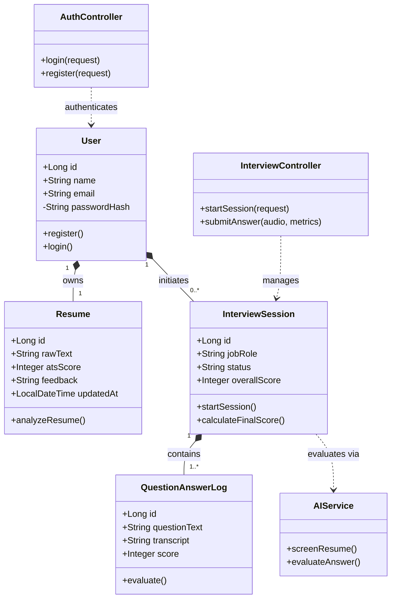
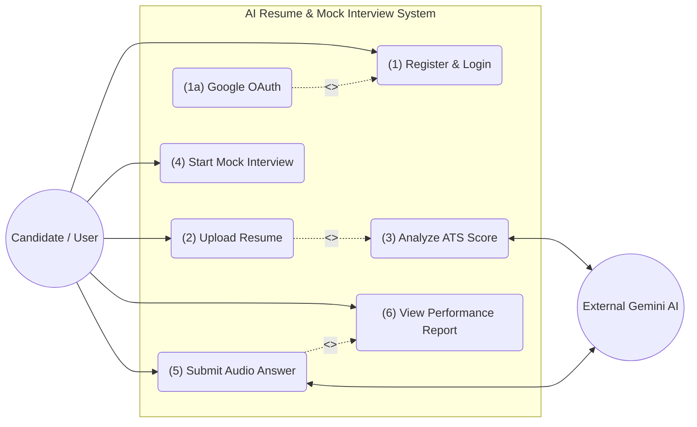
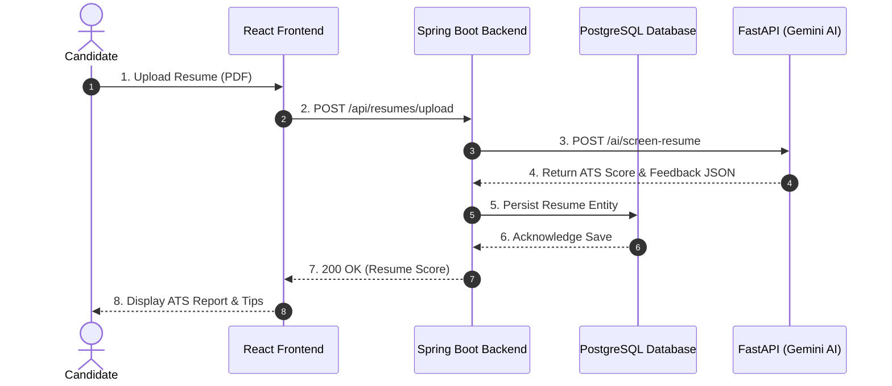
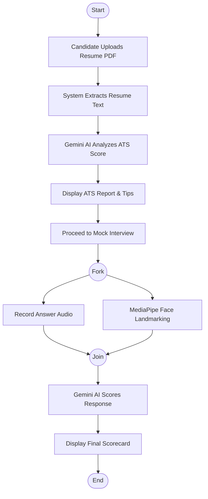
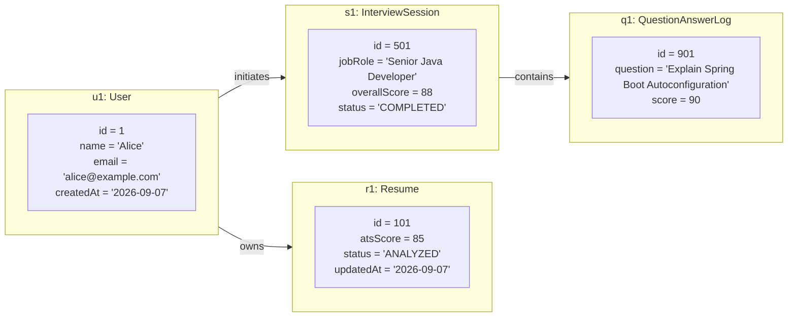
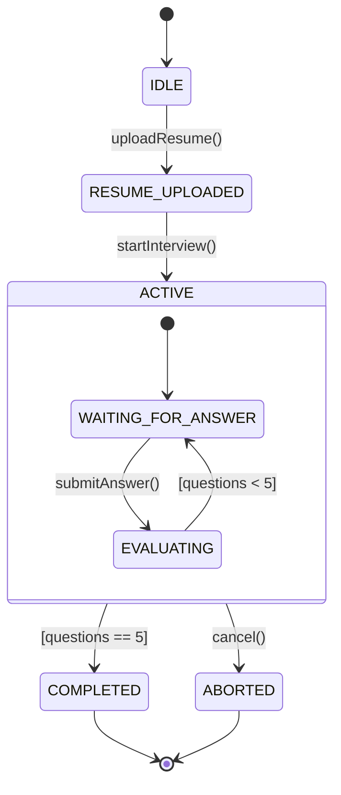
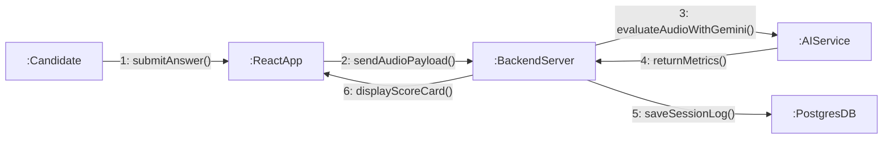
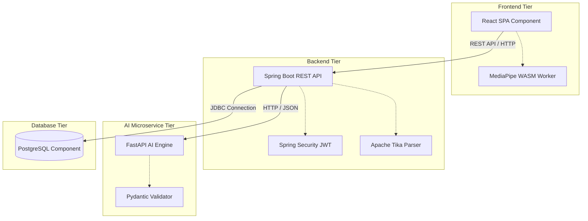
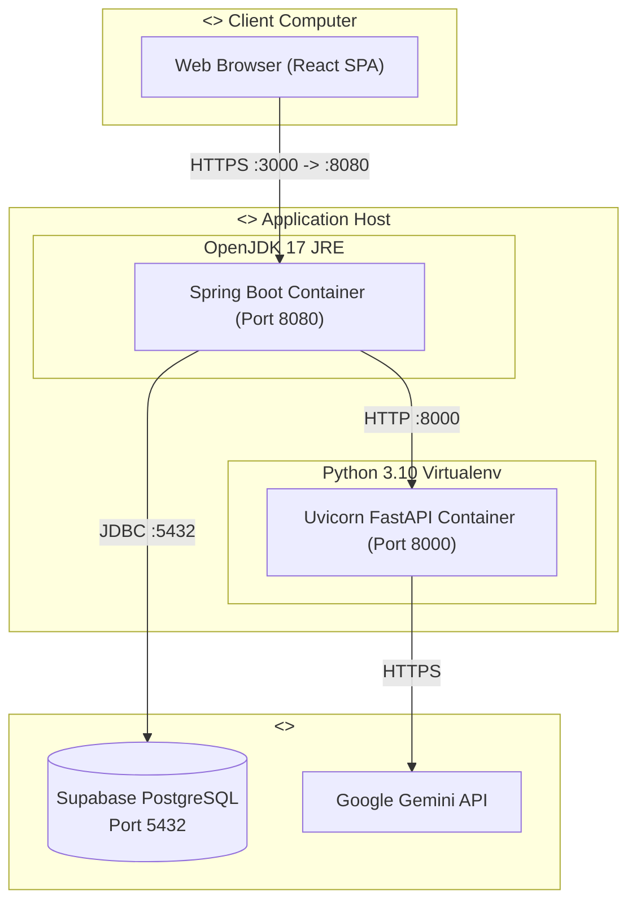

# InterviewIQ AI — Complete UML Design Presentation Document
**System:** AI Resume Screening and Mock Interview System  
**Presentation Track:** System Analysis & Object-Oriented Design (UML Architecture)  
**Date:** September 2026  
**Architecture:** Decoupled 3-Tier Monorepo (React 19 + Spring Boot 3.3 + FastAPI + PostgreSQL + Multimodal AI)

---

## Table of Contents
1. [Class Diagram (Structural)](#1-class-diagram)
2. [Use Case Diagram (Behavioral)](#2-use-case-diagram)
3. [Sequence Diagram (Interaction)](#3-sequence-diagram)
4. [Activity Diagram (Workflow)](#4-activity-diagram)
5. [Object Diagram (Instance Snapshot)](#5-object-diagram)
6. [State Chart Diagram (State Machine)](#6-state-chart-diagram)
7. [Collaboration Diagram (Communication)](#7-collaboration-diagram)
8. [Component Diagram (Subsystem Architecture)](#8-component-diagram)
9. [Deployment Diagram (Physical Hardware & Infrastructure)](#9-deployment-diagram)
10. [Viva / Presentation Defense Guide](#10-viva--presentation-defense-guide)

---

## 1. Class Diagram
### Categorization: Structural Diagram
### Purpose:
Illustrates the core domain entities, their key properties, methods, and relationships in a format that balances architectural completeness with readability.

### Key Presentation Talking Points:
* **Core Entities:** `User` is the aggregate root owning `Resume` (1:1) and initiating `InterviewSession` (1:N).
* **MVC Pattern:** Controllers like `AuthController` and `InterviewController` manage the incoming requests and manipulate the underlying domain models.
* **AI Delegation:** Domain entities delegate AI logic to the stateless `AIService`.

---

## 2. Use Case Diagram
### Categorization: Behavioral Diagram
### Purpose:
High-level view of core user interactions with the system, standard includes/extends, and integration with the external Gemini AI engine.

### Key Presentation Talking Points:
* **Primary Actor:** Candidate interacts with registration, resume upload, mock interview, and analytics features to self-improve and check their performance.
* **UML Stereotypes:** Uses `<<extend>>` for optional OAuth login and `<<include>>` for mandatory AI analysis.
* **Automated External Actor:** External Gemini AI performs heavy processing for ATS scoring and answer evaluation.

---

## 3. Sequence Diagram
### Categorization: Interaction Diagram
### Purpose:
Traces the step-by-step interaction flow for uploading a resume and retrieving AI-driven ATS screening results, explicitly showing database persistence.

### Key Presentation Talking Points:
* **Database Persistence:** Explicitly shows the Spring Boot backend interacting with the PostgreSQL database to ensure state is saved before responding to the user.
* **Decoupled Flow:** The React client communicates with Spring Boot, which orchestrates the call to the FastAPI Gemini AI microservice.

---

## 4. Activity Diagram
### Categorization: Workflow / Behavioral Diagram
### Purpose:
Represents the step-by-step decision flow from resume upload to mock interview execution, including concurrent client-side processing.

### Key Presentation Talking Points:
* **End-to-End Pipeline:** Seamlessly transitions from resume screening to displaying ATS tips, and straight into the mock interview.
* **Concurrency:** The Fork/Join nodes highlight that audio recording and vision analysis (eye contact tracking) occur simultaneously in the browser.

---

## 5. Object Diagram
### Categorization: Structural Diagram (Snapshot)
### Purpose:
Provides a concrete runtime snapshot of instantiated objects during an active candidate session with realistic data.

### Key Presentation Talking Points:
* **Concrete Values:** Demonstrates live instance data showing candidate Alice applying for a "Senior Java Developer" role.
* **Instance Mapping:** Maps directly to class relationships at runtime, showing exact field states.

---

## 6. State Chart Diagram
### Categorization: Behavioral / State Machine Diagram
### Purpose:
Models the lifecycle states of an Interview Session, including internal loop transitions.

### Key Presentation Talking Points:
* **Composite State:** The `ACTIVE` state contains internal transitions, properly looping through question evaluation up to 5 times.
* **Guard Conditions:** Transitions use explicit guard conditions (`[questions < 5]`) to control flow logic.

---

## 7. Collaboration Diagram
### Categorization: Interaction / Communication Diagram
### Purpose:
Highlights object organization and numbered message exchange during answer submission, emphasizing the full backend pipeline.

### Key Presentation Talking Points:
* **Spatial Relationship:** Focuses on structural links between nodes rather than a strict vertical timeline.
* **Full Data Lifecycle:** Shows the complete 6-step loop from user interaction, to AI generation, to persistent DB storage, and back to the UI.

---

## 8. Component Diagram
### Categorization: Structural / Subsystem Diagram
### Purpose:
Shows high-level system modules and protocol interfaces connecting frontend, backend, AI microservice, and database.

### Key Presentation Talking Points:
* **Internal Sub-components:** Highlights key technological choices inside the tiers like Spring Security, Tika, and Pydantic.
* **Standard Protocols:** Tiers communicate via standard REST APIs, HTTP/JSON, and JDBC drivers.

---

## 9. Deployment Diagram
### Categorization: Physical / Infrastructure Diagram
### Purpose:
Maps software artifacts to physical hardware nodes, network ports, and specific execution environments.

### Key Presentation Talking Points:
* **Execution Environments:** explicitly maps out the underlying JRE and Python Virtualenv that host the application servers.
* **Hardware Nodes:** Distinct physical tiers — Client Computer, Application Host, and Cloud Services.
* **Network & Ports:** Clear mapping of ports (`8080`, `8000`, `5432`) and communication protocols.

---

## 10. Viva / Presentation Defense Guide

When presenting these diagrams to your evaluators, be prepared to answer these common architectural questions:

| Question from Evaluator | Recommended Architectural Defense | Related Diagram |
| :--- | :--- | :--- |
| **"Why did you use both Spring Boot and FastAPI instead of writing everything in Python or Java?"** | "We selected a **decoupled polyglot microservice architecture**. Spring Boot provides enterprise-grade transaction management, robust JPA/Hibernate persistence, and Spring Security. Python and FastAPI provide native support for AI/ML libraries and Google GenAI SDKs, isolating compute-intensive AI operations." | Component & Deployment Diagrams |
| **"Where does video processing happen, and does it cause server latency?"** | "Video coaching runs **on the client side** using WebAssembly (WASM) and MediaPipe. Only lightweight score metrics are sent to the backend, eliminating bandwidth bottlenecks." | Sequence & Activity Diagrams |
| **"What happens if an interview is interrupted midway?"** | "The `InterviewSession` uses state tracking with an `ACTIVE` state. Each completed question is saved atomically in `question_answer_logs` via the database, so progress is preserved even if the session aborts." | State Chart & Sequence Diagrams |
| **"Why is Gemini AI used for resume screening?"** | "Google Gemini 1.5 Flash provides fast, low-cost multimodal context processing to analyze resume text against job descriptions and compute accurate ATS compatibility scores." | Sequence & Use Case Diagrams |
| **"Explain the difference between your Sequence and Collaboration diagrams."** | "Our **Sequence Diagram** highlights time-ordered flow and database persistence during resume upload, while our **Collaboration Diagram** highlights object relationships and standard message passing during answer submission." | Sequence & Collaboration Diagrams |

---
*Created for InterviewIQ AI Design Review Presentation — Medium Detail UML Architecture.*
